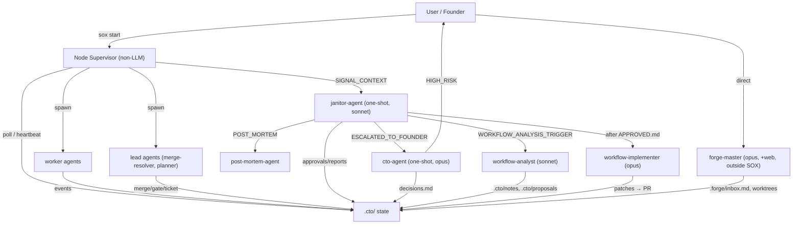
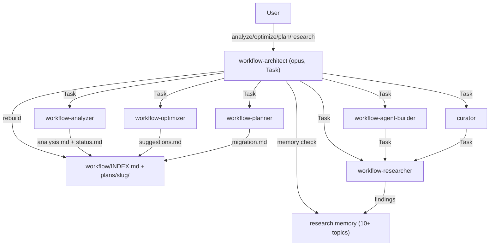

# Workflow analysis — sox-ecosystem

Generated: 2026-06-07

> **Provenance:** live run by workflow-analyzer against the actual user/global agentic
> configuration inherited by this project. The project root itself is a fresh git repo
> with no commits and no project-local `.claude/` directory. All agentic tooling is
> inherited from the global user scope (`~/.claude/`). (Persisted by workflow-architect
> because the analyzer's direct write was permission-blocked; content is the analyzer's verbatim.)

---

## 1. Inventory

### 1.1 Project-local customizations

The project directory `/Users/nix/dev/ai/sox-ecosystem` contains only `.workflow/` and `.git/`. No git commits, no source files, no `package.json`, no `.claude/` directory.

| Item | Path | Summary |
|---|---|---|
| Workflow plan registry | `.workflow/INDEX.md` | Architect-owned engagement index; relevancy-scoring config in frontmatter; one open engagement |
| Engagement plan dir | `.workflow/plans/sox-ecosystem/` | artifacts: `status.md`, `analysis.md`, `analysis.seed.md`, `suggestions.md`, `suggestions.seed.md`, `migration.md` |
| Engagement status | `.workflow/plans/sox-ecosystem/status.md` | State machine for the engagement |
| Seed analysis | `.workflow/plans/sox-ecosystem/analysis.seed.md` | Architect-seeded distillation from research memory (not a live run) |
| Seed suggestions | `.workflow/plans/sox-ecosystem/suggestions.seed.md` | Architect-seeded suggestions from research findings |
| Migration plan | `.workflow/plans/sox-ecosystem/migration.md` | 7-phase greenfield build plan (P0 skeleton to P6 verification), authored by workflow-planner |

**No project-local `.claude/` directory exists.** No project-level `settings.json`, hooks, agents, commands, skills, or MCP config are defined.

---

### 1.2 Global agents (`~/.claude/agents/`)

37 agents installed globally, populated by `sox-active@adhd-subagents` v1.0.20. Default tools for worker agents: `Read, Write, Edit, Glob, Grep, Bash`. Notable: `cto-agent`, `forge-master`, `workflow-implementer` are `model: opus`; `janitor-agent`, `workflow-analyst` are `model: sonnet`; `workflow-analyst` has no Bash (deliberately scoped down); `forge-master` is the only agent with WebFetch + WebSearch and operates outside the SOX supervisor loop.

(Full 37-agent table retained in the analyzer transcript; the load-bearing distinctions are the model and tool-privilege deltas above.)

---

### 1.3 Installed plugins (`~/.claude/plugins/installed_plugins.json`)

19 plugins installed at user scope; 4 enabled.

| Plugin | Version | Enabled | Summary |
|---|---|---|---|
| `sox-cto-system@adhd-subagents` | 2.0.23 | **yes** | Core SOX daemon: janitor, cto-agent, planner, merge-resolver, skills, scripts, templates |
| `sox-active@adhd-subagents` | 1.0.20 | **yes** | Active roster of ~37 workers/leads/specialists |
| `workflow@adhd-subagents` | 0.6.1 | **yes** | architect, analyzer, optimizer, planner, researcher, agent-builder, curator |
| `sox-tools@adhd-subagents` | 1.0.3 | **yes** | SOX CLI + MCP server (`sox`) + skills: reflection, sox-init, workflow-relevancy |
| (15 more) | — | no | sox-biz, sox-core-dev, sox-data-ai, sox-dev-exp, sox-domains, sox-generalist, sox-infra, sox-lang, sox-marketing-skills, sox-meta, sox-portfolio, sox-qa-sec, sox-research, sox-sales-skills, memory-mcp; plus `nx` project-scoped to another repo |

Marketplace source: `sox-subagents` from local file `/Users/nix/dev/ai/claude-agents/.claude-plugin/marketplace.json`. **`sox-active` v1.0.20 duplicates 5 agents also in `sox-cto-system` v2.0.23** (`cto-agent`, `janitor-agent`, `workflow-analyst`, `workflow-implementer`, `planner`).

---

### 1.4 Settings, hooks, permissions (`~/.claude/settings.json`)

**Global model:** `opus`. **defaultMode:** `auto`. effortLevel `high`. autoCompact on.

**Permissions — allow:** `Write`/`Edit` on `~/.claude/plugins/workflow/memory/research/**`; Bash allow-list: `ls pwd cat head tail grep rg wc sort uniq jq diff stat mkdir`.
**Permissions — deny:** `~/.ssh/**`, `~/.aws/**`, `~/.gnupg/**`, `~/.config/gcloud/**`, `~/.kube/**`, `~/.docker/config.json`, `~/.netrc`; `printenv`, `env`, `ngrok`; `Write`/`Edit` on `/etc/**`.

**Hooks (9, all global, every session):**

| Event | Matcher | Command | Purpose |
|---|---|---|---|
| PreToolUse | `Grep\|Glob\|Bash` | gitnexus-hook.cjs | Graph context augmentation (no-op without `.gitnexus/` index) |
| PreToolUse | `Read` | swarm-cost/read-cap.sh | Hard-deny reads >500 lines without explicit `limit` |
| PreToolUse | `Grep` | swarm-cost/grep-cap.sh | Cap grep output at 100 lines |
| PreToolUse | `.*` | swarm-cost/budget-gate.sh | Enforce `TOKEN BUDGET:` hard cap; warn 80%, deny 100% |
| PostToolUse | `Bash` | gitnexus-hook.cjs | Stale-index detection after git mutations |
| PostToolUse | `Bash` | swarm-cost/bash-pattern-miner.sh | Anomaly scan on bash output |
| PostToolUse | `Bash\|Read\|Grep\|Glob` | inline jq → swarm-cost.log | Log tool calls with output >8KB |
| Stop / SessionStart | — | inline jq → swarm-cost.log | Session lifecycle logging |

Plugin-contributed: `sox-tools` SessionStart auto-installs Node deps; `memory-mcp` hooks dormant (disabled).

---

### 1.5 Key SOX meta-loop agents

- **janitor-agent** (sonnet, one-shot): invoked by Node supervisor via SIGNAL_CONTEXT (8 signal types); spawns cto-agent, workflow-analyst, post-mortem-agent. Duties 3/3b/4/4b/6/7 moved to supervisor in "Plan V" (2026-04-18).
- **cto-agent** (opus, one-shot): strategic decision kernel; PROJECT_DECISION + PROTOCOL_PROPOSAL types; hard recursion guard — any proposal touching the 6 meta-loop files escalates to founder regardless of LOC delta.
- **workflow-analyst** (sonnet, no Bash): `analyze`/`propose` modes; spawned by janitor Duty 10.
- **workflow-implementer** (opus): applies approved proposals after cto-agent writes APPROVED.md.
- **merge-resolver** (opus, v1.2.0): merges QA-verified branches in isolated `/tmp/` worktrees.
- **planner** (opus): structured implementation planner for Nx repos; deterministic mutation graphs.

---

### 1.6 Workflow plugin agents (`workflow@adhd-subagents` v0.6.1)

architect (opus, Task — orchestrator), analyzer (opus — this run), optimizer (opus, Task), planner (opus), researcher (web), agent-builder (opus v2.0.1), curator (opus, 4 modes). Pipeline: architect → one specialist via Task → artifact → architect rebuilds INDEX.

---

### 1.7 MCP servers

| Name | Plugin | Status |
|---|---|---|
| `sox` | sox-tools v1.0.3 (`node ${CLAUDE_PLUGIN_ROOT}/mcp-server/index.js`) | Active |
| `memory` | memory-mcp v0.6.4 | Installed, disabled |

SOX daemon runtime config disables all project MCP servers for background processes.

---

### 1.8 Skills

sox, sox-snapshot, cto-schema-validator (sox-cto-system); workflow-memory (workflow); reflection, sox-init, workflow-relevancy (sox-tools); gitnexus-{guide,exploring,impact-analysis,debugging,refactoring,pr-review,cli}; find-skills.

### 1.9 Slash commands

`/subagent-catalog:{fetch,search,list,invalidate}` (global). Disabled `memory-mcp` would add 14 more.

### 1.10 Memory stores

Workflow research memory (`~/.claude/plugins/workflow/memory/research/`, global, 10+ topics/80+ findings, write-gated); per-project `.workflow/plans/<slug>/`; per-project `.cto/` (not here); per-project `docs/catalog/` + `docs/reflection/` (not here); append-only `~/.claude/swarm-cost.log`; daemon roster `~/.claude/daemon/roster.json` (3 active workers in other projects).

### 1.11 Agent-readable docs

Global CLAUDE.md (empty), `.workflow/INDEX.md`, engagement status/migration, sox-cto-system workspace-protocol + 20+ templates + daemon/lead/worker headers, swarm-cost README.

---

## 2. Patterns

**2.1 Orchestration topology — hybrid, two parallel hub/spoke systems + a linear pipeline:**

- **System A (SOX autonomous dev, event-driven hub/spoke):** non-LLM Node supervisor polls `.cto/`, fires typed signals to one-shot janitor; janitor spawns cto-agent / workflow-analyst / post-mortem as 2nd-level spokes; workers + leads pulled directly by supervisor. Janitor does NOT route workers.
- **System B (workflow planning, linear):** architect → one specialist via Task → artifact → architect composes + rebuilds INDEX. Single dispatch per invocation.
- **System C (catalog/reflection, on-demand hub/spoke):** agent-builder and curator each dispatch researcher via Task; curator mutates REFLECTIONS.json only via `reflect.js`.

**2.2 Delegation depth:** both systems cap at ~3 LLM layers.

**2.3 Tool-privilege distribution:** full-privilege set for cto-agent, janitor, workflow-implementer, merge-resolver, planner, forge-master, architect, agent-builder, curator. workflow-analyst deliberately has no Bash (cannot mutate install state). optimizer/planner/researcher: no Bash. forge-master is sole web-capable agent, outside SOX loop.

**2.4 Memory strategy:** multi-scope, partitioned by concern (5 stores listed in §1.10).

**2.5 Evaluation coverage:** **no eval harness, no CI running agents.** Only `relevancy.test.js` + MCP `smoke-test.js`.

**2.6 Automation surface:** 9 global hooks; budget-gate is silent no-op without a `TOKEN BUDGET:` declaration; GitNexus hooks no-op without `.gitnexus/` index; SOX daemon runtime pre-approves all tools.

---

## 3. Flow diagram

### 3.1 SOX autonomous development

### 3.2 Workflow planning pipeline

---

## 4. Observations + alignment vs migration.md

**Project state:** greenfield confirmed — no commits, no source, no `.claude/`. The repo is a pure engagement-tracking directory.

**Ecosystem:** 19 plugins installed / 4 enabled (15 disabled to suppress system-prompt bloat). `sox-active` duplicates 5 `sox-cto-system` agents. `memory-mcp` fully dormant. Only safety constraint in the system is the recursion guard preventing meta-loop self-modification. No agent eval harness.

**ALIGNED with the extension-ecosystem design:**

1. **`plugin.json` + `installed_plugins.json` scope system is a working prototype** of the proposed `extension.json` + multi-scope cascade (`scope: user` / `scope: project` already exist, proven in production).
2. **Type-taxonomy vocabulary is already correct** — the live system ships agents, skills, MCP servers, hooks, commands as plugin sub-namespaces; the plan promotes them to six independent types. Vocabulary right; independence missing.
3. **Research-memory hierarchy mirrors the proposed registry discovery** (`INDEX.md → <topic>/INDEX.md → finding.md` ≈ two-level `registry/index.json`).

**DIVERGENT (gaps the build must close):**

1. **Monolithic plugin versioning vs independent extension versioning** (largest gap): `sox-cto-system` v2.0.23 bundles 4 agents + 3 skills + scripts + templates under one semver; the plan requires Changesets independent mode per extension.
2. **Manifest identity:** live plugins use `name@marketplace`; the plan mandates immutable slug `id` + CI-enforced dedup invariants — no uniqueness/immutability enforcement exists today.
3. **No scaffold generator** — all live extensions authored manually; plan specifies `scripts/new-extension.ts` (4 files/extension).
4. **Distribution is local-file + GitHub, not npm+CDN** — `sox-subagents` marketplace is a local JSON file.
5. **No `validate-manifests.ts` equivalent** — no dedup lint, type↔directory invariant, or secret-pattern lint in CI.
6. **Hook ordering is implicit (array position)** — plan resolves via integer `order` field (default 100); no ordering metadata today.
