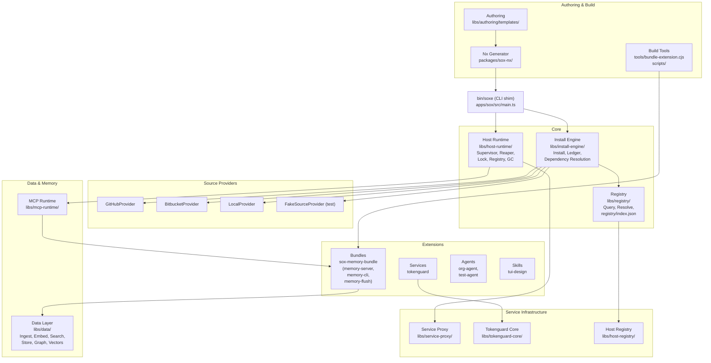

# sox-ecosystem Architecture

## Overview

sox-ecosystem is a monorepo for the SOX platform — a service-oriented extension runtime that manages, installs, and executes extensions (services, skills, agents, bundles, commands, hooks) through a CLI (`bin/soxe`), a host runtime, and an install engine. The platform targets both local and remote extension sources with a unified registry.

- **Symbols**: 18,872 (indexed)
- **Processes**: 300 (indexed)
- **Files**: 868
- **Primary language**: TypeScript
- **Package manager**: pnpm (workspace)
- **Build system**: Nx

---

## Functional Areas

### 1. CLI — `apps/sox/src/main.ts`
The command entrypoint. `bin/soxe` is a thin ESM shim that loads the compiled `dist/apps/sox/main.js`. All CLI verbs are defined in `main.ts`:
- `serve` — start MCP servers (`cmdServe`)
- `service` — service lifecycle (`cmdService`: enable/disable/start/stop/status)
- `init` — scaffold new artifacts
- `upgrade` — upgrade extensions
- `install` — install extensions from source

### 2. Host Runtime — `libs/host-runtime/src/`
The core runtime for managing extension processes:
- **Supervisor** (`supervisor.ts`) — manages child processes (spawn, monitor, reap)
- **Runtime** (`runtime.ts`) — extension lifecycle orchestration
- **Reaper** (`reaper.ts`) — cleanup of dead processes
- **Lock** (`lock.ts`) — singleton guard to prevent duplicate instances
- **Registry** (`registry.ts`) — local extension state registry
- **GC** (`gc.ts`) — garbage collection for stale resources
- **LogManager** (`log-manager.ts`) — structured logging from managed processes

### 3. Install Engine — `libs/install-engine/src/`
Handles the full extension installation lifecycle:
- Source resolution (local paths, npm packages, git repos)
- Dependency resolution and lockfile management
- Extension unpacking and ledger recording
- Multi-scope installation (project, user, org, local)

### 4. Source Providers — `libs/source-provider/src/providers/`
Abstraction layer for fetching extension source code:
- **GitHubProvider** (`github.ts`) — GitHub API source
- **BitbucketProvider** (`bitbucket.ts`) — Bitbucket API source  
- **LocalProvider** (`local.ts`) — local filesystem source
- **FakeSourceProvider** (`fake.ts`) — test/mock provider
- Base types in `libs/source-provider/src/types.ts`

### 5. Registry — `libs/registry/` + `extensions/bundles/`
Manages extension metadata and indexing:
- `libs/registry/` — registry query/resolve logic
- `extensions/bundles/` — bundled extension packages (e.g., `sox-memory-bundle`)
- `registry/index.json` — the synced extension catalog

### 6. Data Layer — `libs/data/`
The data platform — ingest, embed, search, store, graph, vectors:
- `ingest/` — data ingestion pipeline
- `embed/` — embedding provider with model caching
- `search/` — hybrid search (BM25 + vector)
- `store/` — persistent storage
- `graph/` — knowledge graph
- `vectors/` — vector index management
- `analysis/` — data analysis utilities
- `queue/` — async job queue

### 7. Authoring & Templates — `libs/authoring/src/templates/`
Scaffolding templates for generating new extensions:
- Package manifests (`packageJson`)
- README files (`readmeMd`)
- Extension metadata (`extension.json`)
- Used by the `sox init` command

### 8. Extensions — `extensions/`
All loadable extensions organized by type:

| Type | Path | Examples |
|------|------|----------|
| **Services** | `extensions/services/` | `tokenguard/` |
| **Bundles** | `extensions/bundles/` | `sox-memory-bundle/` (contains `memory-server`, `memory-cli`, `memory-flush`) |
| **Agents** | `extensions/agents/` | `org-agent/`, `test-agent/` |
| **Skills** | `extensions/skills/` | `tui-design/` |
| **Commands** | `extensions/commands/` | (custom commands) |
| **Hooks** | `extensions/hooks/` | (lifecycle hooks) |

### 9. Host Registry — `libs/host-registry/`
Client-side registry for the host process to discover and resolve extensions against the synced `registry/index.json`.

### 10. MCP Runtime — `libs/mcp-runtime/`
Model Context Protocol runtime — manages MCP server lifecycle, stdio transport, and tool registration for extensions that implement MCP servers.

### 11. Tokenguard Core — `libs/tokenguard-core/`
Core logic for the Tokenguard service — token usage tracking, mapping, and storage with SQLite-backed persistence.

### 12. Build & Tooling — `tools/` + `scripts/`
- `tools/bundle-extension.cjs` — esbuild-based bundler for all extensions (strips types)
- `tools/smoke-test.mjs` — integration smoke test
- `tools/e2e/` — end-to-end test harness
- `scripts/install.ts` — install script (used both at build and runtime)
- `scripts/smoke-test.mjs` — pre-merge smoke gate
- `scripts/validate-manifests.ts` — extension manifest validation

### 13. Nx Plugin — `packages/sox-nx/`
Custom Nx generator (`packages/sox-nx/src/generators/extension/`) for scaffolding new extensions from templates.

### 14. Service Proxy — `libs/service-proxy/`
HTTP/gRPC proxy layer for services that need external-facing endpoints.

---

## Key Execution Flows

### Flow 1: Extension Installation (`install`)
```
Main → install → resolveSource → fetchSource → validateManifest → resolveDependencies → unpack → ledger.record → linkNodeModules → done
```
Key files: `scripts/install.ts`, `libs/install-engine/src/install.ts`

### Flow 2: CLI Service Lifecycle (`cmdService`)
```
Main → cmdService → runtime.enable → supervisor.spawn → lock.acquire (singleton guard) → health check → status report
```
Key files: `apps/sox/src/main.ts`, `libs/host-runtime/src/supervisor.ts`, `libs/host-runtime/src/lock.ts`

### Flow 3: Source Provider Resolution
```
Main → provider.resolve → provider.fileTree → provider.content → encodeContentPath → return to caller
```
Key files: `libs/source-provider/src/providers/local.ts`, `github.ts`, `bitbucket.ts`, `libs/source-provider/src/types.ts`

### Flow 4: Extension Bundling (`bundle-extension`)
```
Main → buildOne → esbuild.build → writeOutput → copyAssets → verifyChecksum → done
```
Key file: `tools/bundle-extension.cjs`

### Flow 5: Registry Sync
```
Load extensions/ → read extension.json → compute checksum → write registry/index.json → propagate to consumers
```
Key files: `libs/registry/`, `extensions/bundles/`, `registry/index.json`

---

## Architecture Diagram



---

## Dependencies & Data Flow

```
User Input
    │
    ▼
bin/soxe (CLI)
    │
    ├── cmdServe ──► MCP Runtime ──► Extension Bundles ──► Data Layer
    │
    ├── cmdService ──► Host Runtime (Supervisor, Lock, Reaper)
    │                       │
    │                       ├── Spawn managed process
    │                       ├── Health check via runtime
    │                       └── Status reporting
    │
    ├── install ──► Install Engine
    │                   │
    │                   ├── Source Providers (GitHub, Bitbucket, Local)
    │                   ├── Dependency resolution
    │                   ├── Ledger recording
    │                   └── Registry sync
    │
    ├── init ──► Nx Generator ──► Authoring Templates
    │
    └── upgrade ──► Install Engine (re-resolve + re-link)
```

Each extension type has a different lifecycle:
- **Services**: Long-running processes managed by the Host Runtime (supervisor, health checks, reaping)
- **MCP Servers**: Communicate via stdio MCP protocol through the MCP Runtime
- **Skills**: Stateless declarative prompts loaded on-demand
- **Agents**: Agent definitions with mode/model/permission configs
- **Hooks**: Lifecycle hooks triggered by install/service events
